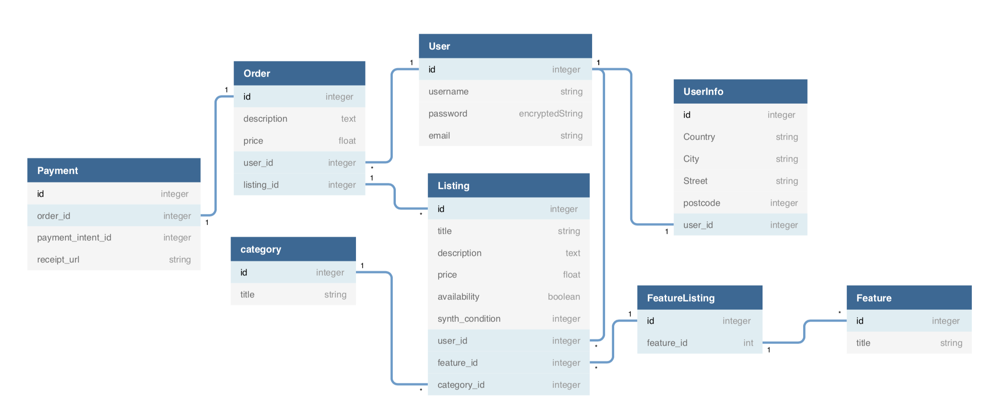

# Identification of the problem you are trying to solve by building this particular marketplace app.

- Currently, there are no online Marketplaces **dedicated** to **buying** and **selling vintage synthesizers.**

- The commonplace to buy and sell vintage synthesizers are *Ebay, Facebook Marketplace* and the online music marketplace *Reverb*. While each of these platforms are stable and allow users to buy and sell various music equipment, none of them specialise in buying and selling vintage synthesizers. In this manner, they each favour the **quantity of products** available over the **quality of products** they sell; compromising the standards of these transactions. This quantity over quality attitude demonstrated from the above-mentioned platforms misses the opportunity for a sincere community to develop. With a focus on the quantity of transactions and products, these platforms foster a transactional relationship between buyers and sellers to which *SythnGain* makes progress towards solving.

- As of 2021, Ebay has a total of 1.7 billion listings with 187 million eBay users worldwide. These numbers in conjunction with the quantity over quality attitude makes it difficult for Ebay to set up systems and protocols that successfully and reliably deliver musical instruments; specifically, musical instruments that are fragile and have many working parts. According to the GSP agreement on Ebay, if an item cannot be shipped due to size or regulations, Ebay can refund the buyer and resell the item. While this may seem an appropriate action to take, in many cases, buyers and sellers have been late to find out about such changes within the transaction and as a result, have been disappointed with the experience. Additionally, Ebay's terms may be amended at any time with a simple posting to the eBay site; to which such terms will take effect immediately. Clearly this is a necessary procedure for such a large enterprise though it further illustrates the implications of a quantity over quality model.

- Another example of the quantity over quality model is evident with the social media marketing platform Facebook hosting approximately 1.74 billion active users every month. Clearly this is an advantage if you are aiming to make quick sales and target are very large audience, but again, that does not foster a sincere community revolving around a central theme outside of transactions.

- Finally, the online marketplace *Reverb* is fundamentally a trusted and reliable source for users to buy and sell equipment. The site is led by musicians and includes protection policies for both the buyer and the seller. *Reverb* does provide an outlet to buy and sell vintage synthesizes however, this is one category among many instruments with each category of instruments having a wide range of factors that go into the selling and distribution.

- In summary, while each of the above mention platforms successfully allow users to buy and sell vintage synthesizers, each platform displays a prioritisation in the quantity of products available, or the quantity of transactions and as a result, misses the opportunity to create and maintain a community which revolves around a central theme. By aiming to solve the problem of buying and selling anything or all musical instruments, these platforms create other problems and make the error of thinking that limitations are somehow a negative quality.

# Why is it a problem that needs solving?

# Link to deployed app

https://synth-gain.herokuapp.com/

# Link to Github Repo

https://github.com/IsaacCavallaro/SynthGain

# Description of SynthGain

## Purpose

- To connect lovers of vintage synthesizers within a digital community.
- Unlike other online marketplaces which sell various music equipment, *SynthGain* is dedicated to buying and selling synthesizers.
- Allows vintage analogue synthesizers to be safely purchased and sold by individuals who understand the properties and challenges of maintaining a vintage synthesizer in the modern world.
- There is an expectation at *SynthGain* that you have a background in music or understand the mechanics involved in maintaining a vintage synthesizer.
- *SynthGain* is a place for lovers of vintage synthesizers to buy and sell these beautiful instruments.

## Benefits of SynthGain

- Connecting lovers of vintage synths.
- Dedicated platform for selling and purchasing vintage synths.
- Secure third party payment system with low transaction fees (Stripe fees < 3%).
- Allowing vintage synths to remain "active" in the community and not end up collecting dust.
- By dedicating its demographic to the community of synth lovers, there is a reduction in propagating opportunists who wish to use the platform as a place to make money.

## Functionality/features

- *SynthGain* allows viewers of the site to become a member with a simple and secure signup procedure using the authentication provided by **Devise.**

- This authorisation restricts guests from purchasing a listing if they are not a member. However, *SynthGain* allows guests pursuing *SynthGain* the ability to view and search for a listing they may be interested in purchasing. Furthermore, guests can see the profile of the user who is selling each item they are considering purchasing.

- After becoming a member of *SynthGain*, users have the ability to easily **create** and **edit** their **user profile** which includes a profile image and their location details.

## Target Audience

- Musicians looking for an online environment that is limited to buying and selling vintage synthesizers.

- Musicians who are wanting an online platform to buy and sell vintage synthesizers without requiring a facebook account.
- Individuals who don't want to use a social media platform in order to sell or buy vintage synthesizers.
- Individuals who have had bad experiences buying or selling music equipment (specifically vintage synthesizers) on other platforms like ebay, facebook marketplace.

## Tech Stack

- **Languages**
    - HTML5 - Website Markup
    - CSS3 - Website Styling
    - JavaScript - Website Styling
    - Ruby - Application Back-end
- **Ruby on Rails**
    - Server-side web application framework
- **PostgreSQL**
    - Relational Database Management System
- **Heroku**
    - Cloud Platform for hosting web applications
- **Amazon S3 (Simple Storage Service)**
    - Cloud Object Storage via a web service interface

## Sitemap v1

## Sitemap v2

# User stories

### ***As a Guest of SynthGain***

- I want to be able to **view listings** and **search** for specific synthesizes by title so that I can quickly find the synth I am looking for to provide a simple user experience.
- I want to be able to **view** the **profile of the seller** so that I can see whether the seller is trustworthy.
- I want to have a **secure** way to sign up for *SynthGain* ****so that I can be assured my information is safe.

### ***As a Seller of SynthGain***

- I want to be able to **create** **listings** that include an **image**, descriptions and a category so that my listing details are clear.
- I want to be able to **edit** my listings (change price, image etc) so that I can update my listings if circumstances change.
- I want to be able to **delete** any of my listings so that I can **remove** any listings I no longer wish to **sell.**
- I want to be able to **receive payment** digitally and in a secure manner so that I don't have to carry change or cash to sell any listings.
- I want to be able to have access to the user's profile who is purchasing my listing so that I can track sales and the users interacting with my profile.

### ***As a Buyer of SynthGain***

- I want to be able to search for **specific synthesizers** by using **keywords** related to the items title ****so that I can find the appropriate synth I wish to purchase.
- I want to be able to see the details of the synthesizer (image, category etc) so that I can understand the condition of the synth I wish to purchase.
- I want to be able to see the **profile of a seller** so that I can see where they live and can connect with them.
- I want to be able to make **payments securely** and see the **receipts of my purchases** so that I can have a record of my transactions.

### ***Authentication & Authorisation of SynthGain***

- I do not want other users to be able to access my account so I am ensured my items and details are protected.
- I do not want other users to be able to edit or delete my listings so that I am ensured that my listings are up to date.

# SynthGain ERD's

## ERD v1

- Prior to building the application, I designed the first version of an ERD for *SynthGain*:

## ERD v2

- While this process of creating ERD v1 was useful in the initial planning and development stages, as the app began to grow, I considered implementing more features. Specifically, I wanted to include a cart feature. This can be seen in the image below:

## ERD Final

- Unfortunately, this cart feature was not able to be implemented due to the deadline of producing an MVP fast approaching. In the end, the MVP was the priority and I decided to remove my cart and join tables and simply the ERD and app.

# Third Party Services

## Devise:

- Devised is a ruby gem that creates sign-up and sign-in forms with user authentication.

## Bootstrap:

- Boostrap is a HTML, CSS and JavaScript library which I used to implement styling across the app. Specifically, bootstrap was used for the navbar, buttons and card layouts.

## AWS:

- Cloud storage of files and images used in and uploaded to the app. This cloud platform supported by Amazon is scalable, reliable and a secure storage method

## Ransack:

- Ransack is a Ruby gem that creates simple search forms and filtering; allowing users of Synthgain the ability to search for listings by their title.

## Stripe:

- A payment software platform implemented in the app to provide buyers and growers with a cashless and secure third party service in which to transact. I chose Stripe as they offer low transaction fees.

## Ultrahook:

- This app uses ultrahook to provide a public webhook endpoint to receive realtime information from Stripe.

# SynthGain's models and their active record associations

Below is a list of *SynthGain's* central models and what they represent.

## User:

- The User model represents the users of the *SynthGain* app. This includes users who wish to sell or buy listings on the app.

## User_info:

- The User_info model represents the user profile which includes the Users location details.

## Listing:

- The Listing model represents the products (in this case synthesizers).

## Feature:

- The Feature model represents the features of the Listing. Since a Listing can have many features which can be associated with many listings, a join table was created. This can be seen in the ERD and additionally by the next model included in this list, feature_listing.

## Feature_listing:

- See above

## Category:

- The Category model represents what category the Listing falls under. This app uses three categories:
    - Modular
    - Monophonic
    - Polyphonic

## Payment:

- The Payment model represents the orders/purchases made which are associated with the User and the Listing purchased.

## Rails associations

- Rails supports six types of associations, namely:
    - belongs_to
    - has_one
    - has_many
    - has_many :through
    - has_one :through
    - has_and_belongs_to_many

This project uses the first five outlined above.
- The list below again illustrates the central models to this app but with the addition of their corresponding associations.

## User:

- has_many :listings
    - This indicates a one-to-many connection with the Listing model.
    - In order to implement this relationship, the Listings table requires the User_id as a foreign key in addition to setting up this association between the models. This can be seen in the projects schema line 133: **add_foreign_key "listings", "users"**
    - In short, a user of SynthGain has sell or buy many synthesizers.

- has_one :user_info
    - This association indicates that the User model has reference to this model. In other words, the User model can fetch User_info data through this association.
    - In order to implement this relationship, the User_info table requires the User_id as a foreign key in addition to setting up this association between the models. This can be seen in the projects schema line 136: **add_foreign_key "user_infos", "users"**
    - In short, A user will only have one profile and cannot have many profiles associated with their user account.

## User_info:

- belongs_to :user
    - This belongs to User association sets up a connection between User_info and the User model.
    - As mentioned above, user_infos is a foreign key for the users table. In this manner, the user_info "belongs to" the user.
- has_one_attached :picture
    - This sets up a one-to-one mapping between records and files in such that each record can have one file (picture) attached to it.

## Listing:

- belongs_to :category
    - This belongs to Category association sets up a connection between the Listing and the Category model.
- belongs_to :user
    - This belongs to User association sets up a connection between Listing and the User model.
- has_many :feature_listings
    - This has many feature_listings indicates a one-to-many connection with the feature_listing model.
- has_many :features, through: :feature_listing
    - This has many through association sets up the many-to-many connection between Listing and Features.

## Feature:

- has_many :feature_listings
    - This has many feature_listings indicates a one-to-many connection with the feature_listing model.
- has_many :listings, through: :feature_listings
    - This has many through association sets up the many-to-many connection between Feature and Listings.

## Feature_listing:

- belongs_to :listing
    - This belongs to Listing association sets up a connection between Feature Listing and Listing model.
- belongs_to :feature
    - This belongs to Feature association sets up a connection between Feature Listing and the feature model.

## Category:

- has_many :listings
    - This has many Listings association sets up a connection between Category and Listings.
    - In short, a category can be related to many Listings where as a Listing will only have one category.

## Payment:

- has_many :listings
    - This has many Listings association sets up a connection between Payment and Listings.
    - In short, a Payment can be related to many Listings whereas a Listing will only be associated with one Payment.
- has_one :user
    - The has one user association illustrates that a Payment will only reference one user and not many.

# Database relations implemented in SynthGain

## User & Listing

- When looking at the relationship between User and Listing, it can be seen that:
    - A User has many Listings.
    - A Listing belongs to a User.
- This active record association between a User and Listing represents **a one-to-many association.**

- This relationship is evident in the final Entity Relationship Diagram (ERD). Importantly, the * refers to many while the 1 does not. In other words, the 1 may refer to either a **belongs to** or **has one** while the * refers to **has many**.

- The image below illustrates this relationship clearly and demonstrates that a User **has many** Listings while a Listing **belongs to** one User.

## User & User_info

- When looking at the relationship between User and User_info, it can be seen that:
    - A User has one User_info.
    - User_info belongs to a User and has one attached picture.
- This active record association between a User and Listing represents a **one-to-one** association.

- The image below illustrates this relationship clearly and demonstrates that a User **has one** User info while the User Info **belongs to** one User.

## Listing & Category

- When looking at the relationship between Listing and Category, it can be seen that:
    - A Listing belongs to Category.
    - A Category has many Listings.
- This active record association between a Listing and Category represents a **one-to-many** association.
- The image below illustrates this relationship clearly and demonstrates that a Listing **belongs to** a Category while a Category **has many** Listings.

